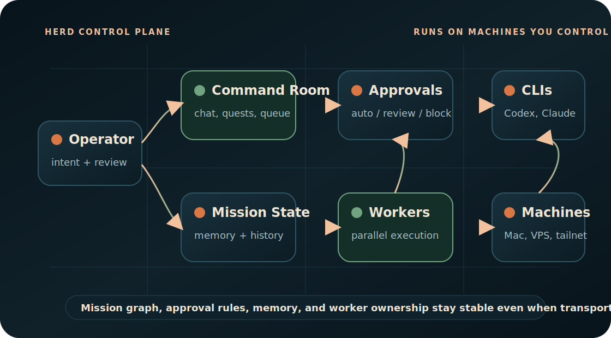

<p align="center">
  
</p>

<p align="center">
  <a href="#quickstart"><strong>Quickstart</strong></a> &middot;
  <a href="./docs/index.md"><strong>Docs</strong></a> &middot;
  <a href="./docs/reference/cli.md"><strong>CLI</strong></a> &middot;
  <a href="./CHANGELOG.md"><strong>Changelog</strong></a> &middot;
  <a href="./docs/operate/machines.md"><strong>Machines</strong></a> &middot;
  <a href="./SECURITY.md"><strong>Security</strong></a> &middot;
  <a href="#community-and-support"><strong>Community</strong></a> &middot;
  <a href="./docs/troubleshoot.md"><strong>Troubleshooting</strong></a> &middot;
  <a href="https://herd.gehirn.ai"><strong>Website</strong></a>
</p>

<p align="center">
  <a href="./LICENSE"></a>
  <a href="./docs/llms.txt"></a>
  <a href="https://herd.gehirn.ai/install.sh"></a>
</p>

# Herd is the meta-harness for agent interaction.

Cursor is obsolete. Pair-programming with one chatbot is a dead end; the next interface is Herd: a meta-harness above Codex, Claude Code, Gemini CLI, OpenCode, and the machines where they run.

Herd owns mission state, worker orchestration, memory, approvals, and the command-room surface. Connectivity and execution stay delegated to harnesses and infrastructure you already trust: provider CLIs, SSH, Tailscale, hosted runtimes, and your own reverse proxy. The mission graph and execution rules stay stable even when the underlying harness or transport changes.

**Manage agent work, not terminal tabs.**

| Step | Operator action | Herd outcome |
| --- | --- | --- |
| **01** | Install the control plane on a trusted machine. | Hermetic Node/pnpm toolchain, local env, server boot, and bootstrap sign-in. |
| **02** | Connect provider auth and machines. | Codex, Claude Code, Gemini CLI, OpenCode, local hosts, SSH boxes, and Tailscale machines become explicit runtime targets. |
| **03** | Run commanders and workers from Command Room. | Work is queued, delegated, reviewed, remembered, and recoverable. |

## What Herd Is

Herd is an open-source meta-harness for personal agent fleets.

It looks like an operating room for agent work. Under the hood: commanders, workers, persistent memory, agent-harness readiness, machine routing, action policies, approvals, public docs, and an install path that keeps the runtime on infrastructure you own.

```text
operator intent -> Herd meta-harness -> agent harnesses -> your machines -> durable mission state
```

## Herd Is Right For You If

- You coordinate more than one AI agent harness and need a persistent command surface above them.
- You run the web control plane on a Linux host and connect only machines you administer.
- You want agents to keep mission memory across provider sessions, browser tabs, and worker restarts.
- You need sensitive actions to be reviewable instead of blindly executed.
- You want public, agent-readable docs that describe setup, operations, references, and recovery.

## Quickstart

The installer is hermetic for the Node toolchain. It needs `git`, `curl`, `tar`, and outbound HTTPS; it installs Node `22.16.0` and pnpm `10.23.0` in a local toolchain directory without replacing or relying on your system Node. Herd uses Node's built-in SQLite driver for the local runtime-session database, so older Node 22 builds that require `--experimental-sqlite` are not supported.

```bash
curl -fsSL https://herd.gehirn.ai/install.sh | bash
```

The installer clones Herd, prepares the local app environment file, installs the hermetic toolchain and dependencies, builds the app, boots the shell once, seeds a one-time bootstrap API key, and prints the local sign-in URL.

Continue with the [full quickstart](./docs/getting-started/quickstart.md) to complete first-run onboarding, provider auth, machine readiness, and the first useful commander run.

## Feature Matrix

<table>
<tr>
<td width="33%"><strong>Commanders</strong><br/>Durable agent identities with memory, conversations, quests, and worker ownership.</td>
<td width="33%"><strong>Workers</strong><br/>Delegated execution sessions on registered machines the operator controls.</td>
<td width="33%"><strong>Approvals</strong><br/>Action policy can auto-run, queue for review, or block external actions.</td>
</tr>
<tr>
<td><strong>Agent Harnesses</strong><br/>Uses provider CLIs where they already run instead of hiding credentials in a black box.</td>
<td><strong>Workspace Context</strong><br/>Commanders operate in real repos with file context, route-aware prompts, and durable traces.</td>
<td><strong>Public Docs</strong><br/>Human docs plus `llms.txt` cover setup, concepts, operations, references, and troubleshooting.</td>
</tr>
</table>

## Problems Herd Solves

| Without Herd | With Herd |
| --- | --- |
| One chatbot owns the conversation, state, and bottleneck. | Commanders assign parallel workers while Command Room keeps the mission coherent. |
| Agent sessions vanish when a tab, machine, or provider session dies. | Mission state, memory, approvals, and history persist outside any single transport. |
| Remote machines and local laptops require bespoke scripts and manual tracking. | Machines are registered, checked for readiness, and used as explicit worker execution targets. |
| External actions either run blindly or require constant babysitting. | Action policies make approval, auto-run, and block behavior inspectable and adjustable. |

## Bundled Commander Workforce

Fresh Herd installs include a backend-owned commander marketplace and a starter workforce:

- **Asina**: engineering manager for issue triage, code investigation, review, orchestration, and release follow-through.
- **Einstein**: research intelligence analyst for web research, knowledge search, domain distillation, and reports.
- **Alfred**: general assistant for meeting prep, scheduling support, inbox/doc triage, and daily follow-through.

Open the Marketplace page or complete first-run onboarding to install the starter workforce. Packages are inspectable in the bundled commander package directory; each package contains `COMMANDER.md`, `skills.manifest.json`, `memory-seed.md`, `onboarding.md`, and examples. The required starter skill dependencies ship in `agent-skills/herd-starter/` so a fresh public checkout has the workflows the bundled commanders advertise.

## Deploy Shapes

| Shape | Use it when | Docs |
| --- | --- | --- |
| **Linux web host** | You want the supported self-hosted control plane behind your own reverse proxy or load balancer. | [Hardening](./docs/operate/hardening.md) |
| **iOS client** | You want a supported mobile client connected to your Herd instance. | [Platform support](./docs/reference/platforms.md) |
| **macOS / Windows** | Unsupported for v1 self-hosted control-plane deployment. | [Platform support](./docs/reference/platforms.md) |

## Docs

Full documentation lives under [`docs/`](./docs/index.md):

- [Quickstart](./docs/getting-started/quickstart.md)
- [Hardening](./docs/operate/hardening.md)
- [Provider auth](./docs/operate/provider-auth.md)
- [Credential pools](./docs/operate/credential-pools.md)
- [Machines and workers](./docs/operate/machines.md)
- [Uninstall](./docs/operate/uninstall.md)
- [Workspace](./docs/operate/workspace.md)
- [Channels](./docs/operate/channels.md)
- [Commanders](./docs/concepts/commanders.md)
- [Organization](./docs/concepts/org.md)
- [Workers](./docs/concepts/workers.md)
- [Command Room](./docs/concepts/command-room.md)
- [Approvals](./docs/concepts/approvals.md)
- [CLI reference](./docs/reference/cli.md)
- [Changelog](./CHANGELOG.md)
- [API reference](./docs/reference/api.md)
- [Platform support](./docs/reference/platforms.md)
- [Naming policy](./docs/reference/naming.md)
- [Security policy](./SECURITY.md)
- [Troubleshooting](./docs/troubleshoot.md)
- [Agent-readable llms.txt](./docs/llms.txt)

## Community And Support

Use GitHub issues for reproducible bugs and scoped feature requests. Use the
Pioneering Minds AI community at https://pioneeringminds.ai for support,
operator discussion, roadmap discussion, and open-ended community conversation.

GitHub Discussions are intentionally disabled for this repository.

Before opening a pull request, read [CONTRIBUTING.md](./CONTRIBUTING.md) and
the [Contributor License Agreement](./CLA.md). Maintainers review and merge
accepted pull requests.

## License

The current Herd release line, beginning with `v0.0.8-beta`, is available under the
[GNU Affero General Public License version 3](./LICENSE), identified by SPDX as
`AGPL-3.0-only`.

- You may use, modify, and distribute Herd, including for commercial purposes,
  under the AGPL.
- If you run a modified version over a network, the AGPL requires you to offer
  the corresponding source to users who interact with it remotely.
- A separate paid commercial agreement is available for proprietary or other
  non-AGPL use. No license purchase is required for commercial use that
  complies with the AGPL.
- Earlier tagged releases remain available under the license terms included
  with those releases.
- See [COMMERCIAL-LICENSE.md](./COMMERCIAL-LICENSE.md) and [NOTICE](./NOTICE).
